# EduHub

EduHub is a one-stop app for students of Ngee Ann Poly that merges the features of NPal, Brightspace and NPGO. We think that it is a hassle for students to juggle between these three apps during their poly life. For example, students usually have to have these three apps open to check their timetable (NPal), take attendance (NPGO) and access module materials (Brightspace). Hence, EduHub serves as a culmination of the features of these three apps to help students navigate their poly life seamlessly. Gone are the days where students have to open multiple tabs just to go about their day!

Furthermore, EduHub also features a points system and a redeem store to incentivise students to use the app!

## Design Process

As mentioned above, the primary goal of EduHub was to make a one-stop app that merges the features of NPAL, Brightspace and NPGO, so that students would find their daily poly life easier. This means that our users do not have to juggle between so many tabs and potentially lag their devices or find doing assignments cumbersome, because EduHub incapsulates all integral features of Npal, Brightspace and NPGO. In addition to that, we also want students to have a platform for them to seek help if they run into issues while doing their assignment. Hence, EduHub also has a "Student Support" page where users can post their own queries and let other users answer.

To illustrate this, here are some user stories:

For example, a student that wants to keep track of his timetable and also revise learning materials at the same time does not have to open two seperate apps (NPGO and Brightspace) to do so. Instead, the student just has to make use of EduHub's timetable page and assignments page.

Another example, a student might be running into issues regarding the implementation of their API component while doing their Integrated Project. However, he does not have to worry as he can just go onto EduHub and post a question there in the "Student Support" page.

A student who has a low-end PC might cause lag to occur when too many tabs are open on their browser, such as Brightspace and NPal. However, with the introduction of EduHub, users do not have to worry about their browser lagging as all features of Brightspace and NPal are in the same website.

Low-fidelity prototype: https://www.figma.com/design/KWyebg93bnHai9Iy9uRJ3D/EduHub-Low-Fidelity?node-id=0-1&t=KL0O1VTYVtThYkKp-1

High-fidelity prototype: https://www.figma.com/design/vCXfjYOyMaTAc93VTvoHb5/EduHub-High-Fidelity-Prototype?node-id=0-1&t=mUwTeuB5PrtxU7VM-1

## Features

### Existing Features

- Event Slideshow: A slideshow that flashes through different events occuring in NP's physical campus right now, which might entice users to take part in these events.

- Achievement Collection: EduHub offers a variety of achievements for users to collect so that users can incentivised to use EduHub extensively by having the urge to hunt down achievements.

- Calendar and timetable: EduHub has a built-in calendar and timetable so users can see when their assignments are due and when their lessons will be taking place. This gives the users peace of mind when it comes to adhering to deadlines and also improves their time management.

- Daily tasks: EduHub also has a "Daily Task' feature, where users will be greeted with 3 tasks everyday, categorised in increasing difficulty (Green being easy, orange being medium, red being hard). Furthermore, when users finish a task and claim it, they may earn points and also an achievement. This incentivises users to log-in everyday to earn their daily points, making using EduHub a habit.

- Redeem store: EduHub has a redeem store where users can use their hard-earned points to redeem for NP merch, which gives users a "goal" to work towards.

- Help/ FAQ Page: EduHub has a help tab where there are four frequently asked questions that users usually ask, and a drop-down arrow that users can click, which would display the answers to those questions. This gives users a convenient place for them to look up answers to the questions they might have, which allows users to have a better understanding of NP and EduHub.

- Campus map: EduHub has an interactive campus map (powered by Google maps) to allow users to navigate throughout the school.

- Student support: EduHub has a "Student Support" page where users can post a query that they might have regarding their modules/assignments, where other users can then reply to them. This gives users a piece of mind while doing their assignments as they will know that they can rely on the EduHub community.

- Password protected account: Users have to log in to their EduHub account via their NP email and the correct password (controlled via API). This means that EduHub accounts are secure and users will not have to worry about others compromising their account security.

### Features left to implement

- Working comment section: A function which allows users to type in a comment and have the text be reflected in the comment box.

## Technologies used

- FullCalendar: https://fullcalendar.io/
  - The project uses FullCalendar's interactive calendar to simulate the calendar function.

## Assistive AI

1. Restdb API (Username and password): ChatGPT was used to help me implement my restdb API into my login screen.

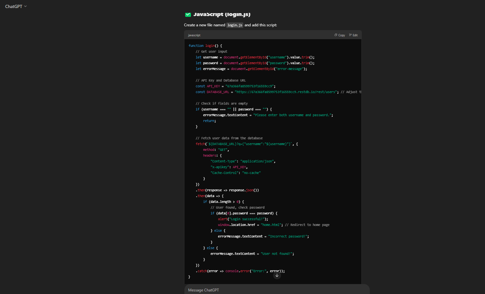

2. Help page drop-down textbox function: ChatGPT was used to code the Javascript code for the drop-down textbox function in the help tab.

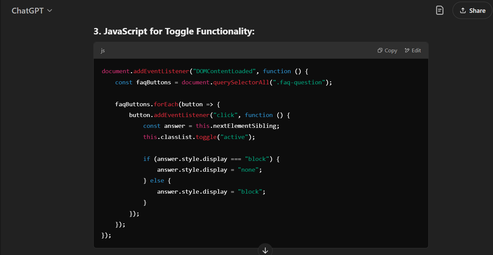

3. Achievement pop-up: ChatGPT was used to code the Javascript code for the pop-up feature when users claim a daily task.

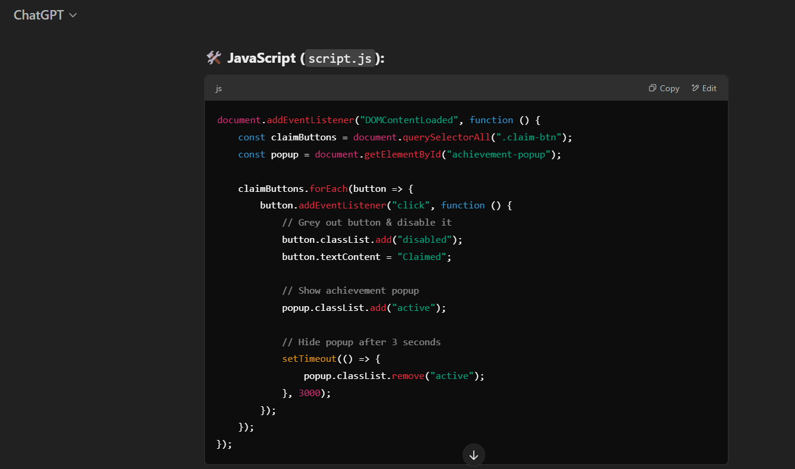

4. Timetable zoom-in: ChatGPT was used to code the Javascript functionality of zooming into the timetable image when a user clicks on it.
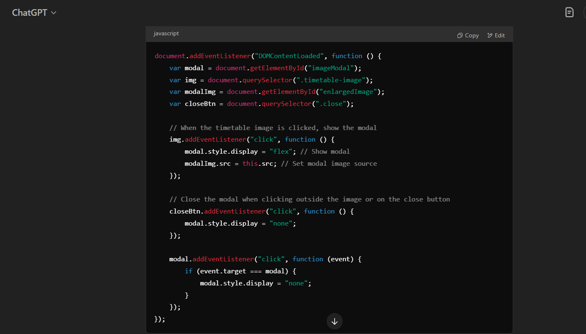

5. Bootstrap Nav bar: ChatGPT was used to code the nav bar using bootstrap.
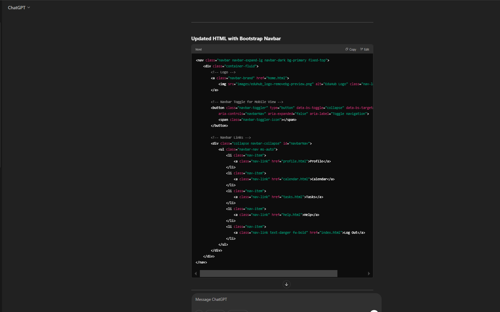

6. Bootstrap Nav bar: ChatGPT was used to code the grid layout of the student support page.
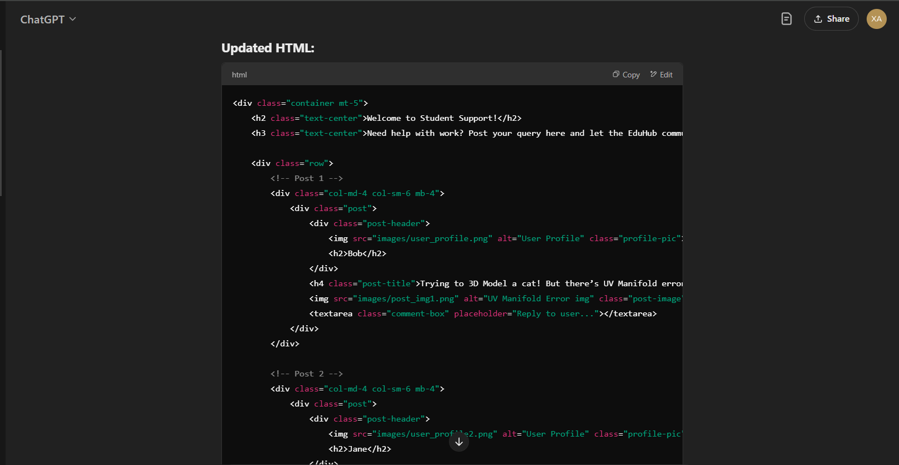
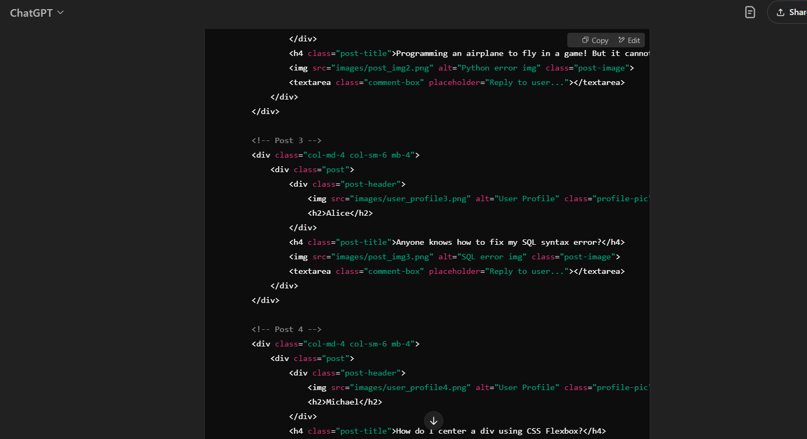
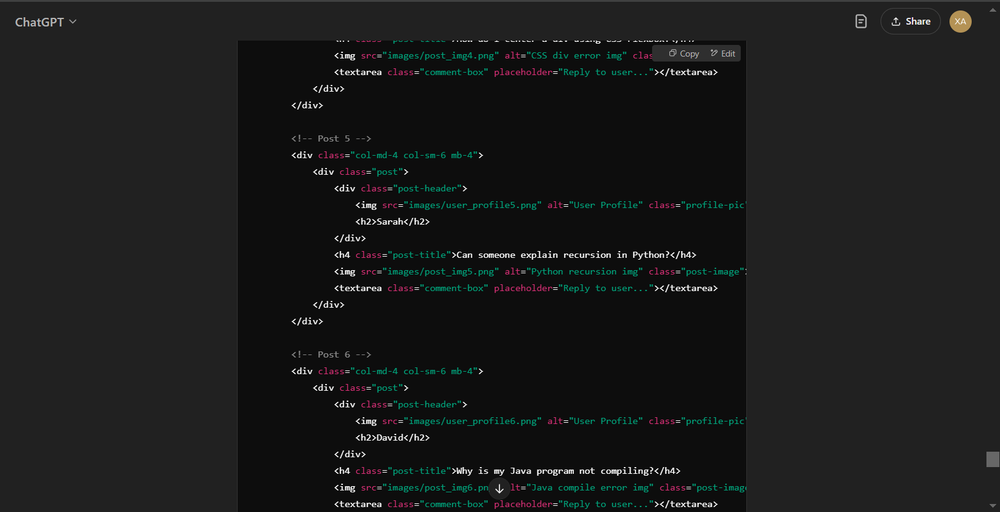
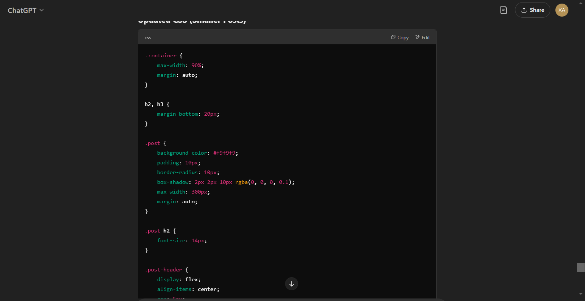
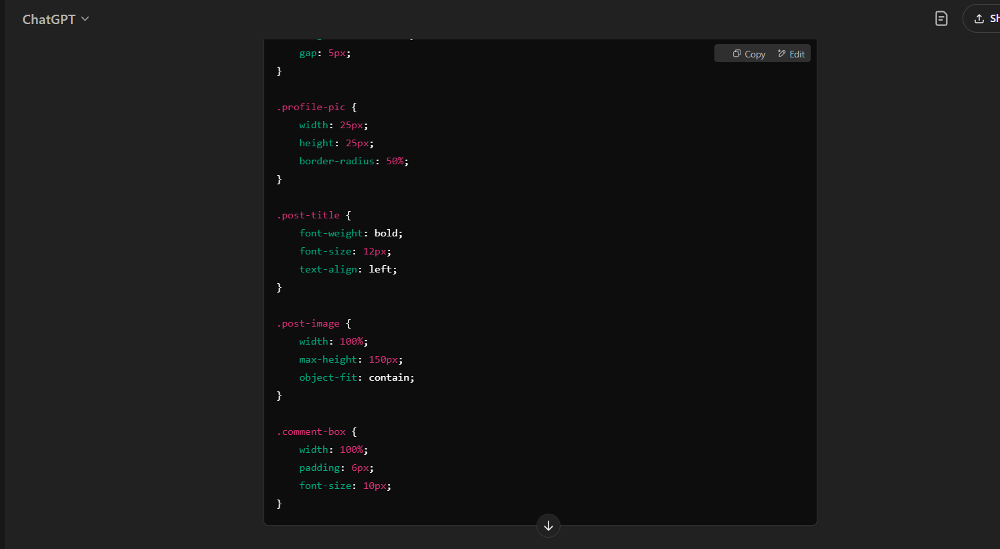

7. Lottie animation functionality with login button: ChatGPT was used to code the logic behind the lottie animation pausing when login button is pressed.
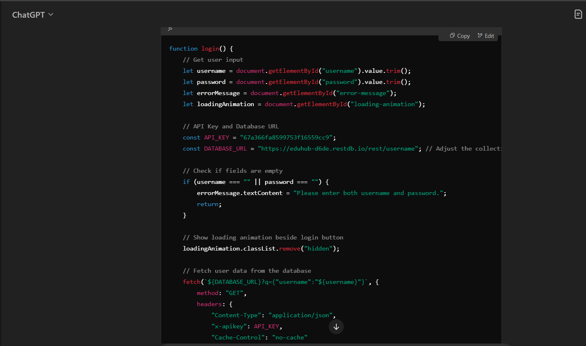
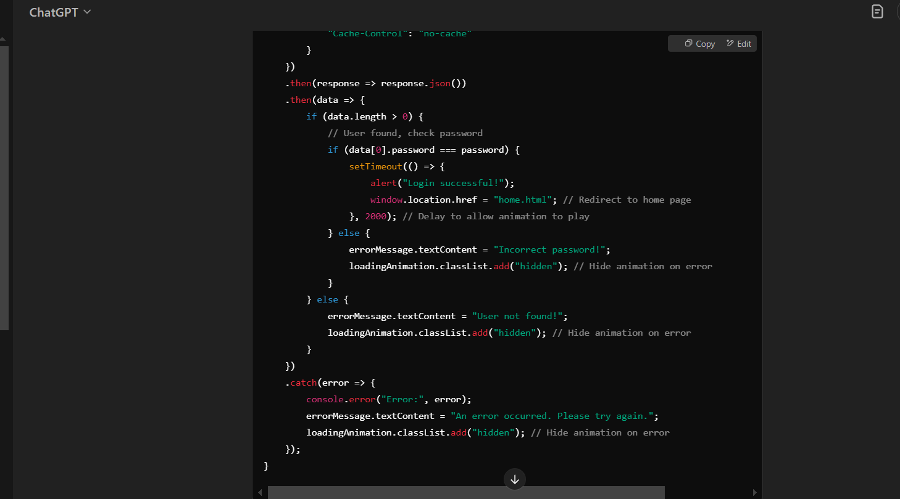
## Testing

1. Daily Tasks:

- Go to daily tasks page

- Click claim on a daily task

- Check if achievement pops up

EduHub has limited functionality on mobile devices as not all web pages used bootstrap. However, on those that are using bootstrap, it works well on mobile devices as the nav bar will shrink into a box that acts like a drop-down menu.

The most common problem we found when we were coding was that our Javascript functionality wouldn't work if said code was in the same JS file as another Javascript code. For example, when I was coding the achievement pop-up page and placed the AI-assisted code into "script.js", which already had the JS code for the slideshow, it just refused to work. As a result, we had to make a seperate JS file every time there was Javascript functionality in our website.

## Credits

### Content

- NP Campus map is from the official Ngee Ann Poly website (https://www.np.edu.sg/docs/default-source/student-life2/fop/Campus-map.pdf)

- CCA info is from NP website (https://www.np.edu.sg/student-life/clubs-societies)

### Media

- Event images from the slideshow were obtained from Outlook via emails sent by the school

- Images for the CCAs are from the NP website (https://www.np.edu.sg/student-life/clubs-societies)

- Timetable image is from our personal NPal

- The links for the cover images are as follows: 

3D (https://www.google.com/url?sa=i&url=https%3A%2F%2Fsinmordaza.com%2Fnoticia%2F203492-el-cubo-rubik-cumplio-47-anos.html&psig=AOvVaw2Qn-tki_WNxItVNG7DQ9pm&ust=1739166554208000&source=images&cd=vfe&opi=89978449&ved=0CBAQjRxqFwoTCJinnLnytYsDFQAAAAAdAAAAABAJ), 
  
ID (https://researchleap.com/interdisciplinary-comparison-of-innovation-processes-differences-similarities-and-spillovers/), 

AD (https://www.google.com/url?sa=i&url=https%3A%2F%2Fwww.facebook.com%2Fgrantwiggins%2F&psig=AOvVaw07IrLSEeoKnVusrpoJgMR-&ust=1739166689847000&source=images&cd=vfe&opi=89978449&ved=0CBAQjRxqFwoTCODl6ffytYsDFQAAAAAdAAAAABAE), 

PMT (https://www.nimrithatech.com/company.php)

Avatar images:

dog: https://www.instagram.com/jetapets/p/DA18KpJiEYm/

girl: https://topdanangcity.com/avatar-cute/

hamster: https://fr.freepik.com/photos-vecteurs-libre/kawaii-face/5

blue def male: https://www.freepik.com/free-vector/blue-circle-with-white-user_145857007.htm

def cartoon male: https://www.dreamstime.com/%D0%BF%D0%B5%D1%87%D0%B0%D1%82%D1%8C-man-avatar-profile-male-face-icon-vector-illustration-image226594812

sky: https://www.nicepng.com/ourpic/u2q8t4o0w7u2u2o0_circle-profile-picture-tumblr-circle-profile-picture-tumblr/

D pfp was also taken from figma prototype with the background removed by bg remover.

merchandise:

shirt: https://media.karousell.com/media/photos/products/2022/4/6/ngee_ann_polytechnic_open_hous_1649258745_7d66d440

bear: https://th.bing.com/th/id/OIP.qFScZssCe-5eNuNBqIP8ygHaHa?rs=1&pid=ImgDetMain

shirt2: https://encrypted-tbn0.gstatic.com/images?q=tbn:ANd9GcTWPyxNI2k5wXlLg9UDk0AFzwjsBZSyqx7T5g&s 

student support images:

3d cat: https://www.google.com/url?sa=i&url=https%3A%2F%2Fzeelproject.com%2F6417-other-models-creature-max-obj-fbx.html&psig=AOvVaw3v9AC30Xec-qAY_uQsqgQ1&ust=1739094162784000&source=images&cd=vfe&opi=89978449&ved=0CBAQjRxqFwoTCPCsmODks4sDFQAAAAAdAAAAABAE

3d repo: https://www.google.com/url?sa=i&url=https%3A%2F%2Fforum.revopoint3d.com%2Ft%2Ffirst-test-scan-the-retopoligizing-in-maya-2022%2F3170&psig=AOvVaw0Gaax0hWoynvZuTP-qiQu2&ust=1739170042938000&source=images&cd=vfe&opi=89978449&ved=0CBAQjRxqFwoTCPjthbj_tYsDFQAAAAAdAAAAABAE

3d angon: https://www.google.com/url?sa=i&url=https%3A%2F%2Fwww.reddit.com%2Fr%2FMaya%2Fcomments%2F10ly31p%2Fwhen_are_ngons_ok%2F&psig=AOvVaw0Cv_DN0ab6jNo5N7O-ltaZ&ust=1739170073623000&source=images&cd=vfe&opi=89978449&ved=0CBAQjRxqFwoTCMjjusX_tYsDFQAAAAAdAAAAABAE 

java error: https://www.google.com/url?sa=i&url=https%3A%2F%2Fstackoverflow.com%2Fquestions%2F46229788%2Fwhy-does-java-not-compile-my-code&psig=AOvVaw3dsgYPFHtILpYX4aQgExEP&ust=1739170093776000&source=images&cd=vfe&opi=89978449&ved=0CBAQjRxqFwoTCPiN2tD_tYsDFQAAAAAdAAAAABAE 

sql error: https://www.google.com/url?sa=i&url=https%3A%2F%2Fmedium.com%2Fgeekculture%2Ftagged%2Ferror-message&psig=AOvVaw1AMIltKukleHPlX1j0pwq9&ust=1739170227126000&source=images&cd=vfe&opi=89978449&ved=0CBAQjRxqFwoTCICV-46AtosDFQAAAAAdAAAAABAE 

vsc code: Taken from a random vsc file we had. 

Achievements pop up image was taken from our figma prototype ( you can view via our figma link)

### Icons

All icons here were taken from Icons8 (https://icons8.com/)

3d: https://icons8.com/icon/BEa3DoPM5tos/3d 
ps: https://icons8.com/icon/11113/adobe-photoshop
code: https://icons8.com/icon/7692/code 
unity: https://icons8.com/icon/39848/unity
jira: https://icons8.com/icon/7EZ6mRn825lD/jira
vsc: https://icons8.com/icon/121602/visual-studio
egg: https://icons8.com/icon/39558/easter-egg">Egg
arrow-down: https://icons8.com/icon/99977/sort-down
instagram: https://icons8.com/icon/Xy10Jcu1L2Su/instagram
linkedin: https://icons8.com/icon/xuvGCOXi8Wyg/linkedin
YT: https://icons8.com/icon/19318/youtube
telegram: https://icons8.com/icon/63306/telegram-app
back arrow: https://icons8.com/icon/39944/left-arrow 
location: https://icons8.com/icon/fLFTtJbNqW1j/location
store: https://icons8.com/icon/15893/shopping-cart 

plus button taken from figma prototype

### Animations
login animation link: https://lottie.host/embed/af12b6c2-51d4-48ea-a6ba-c1fa91b29b2e/3QiV8oPwY2.lottie 

### Aknowledgements

- EduHub's features and structure was largely inspired by NPGO, Brightspace and NPal. However, the daily tasks system and achievements system are largely inspired by gacha games such as Genshin Impact and Honkai: Star Rail.

-GitHub link: https://github.com/10267815E/ID_EduHub_website

### Roles

Front-end developer: Xander

API developer: Rayner